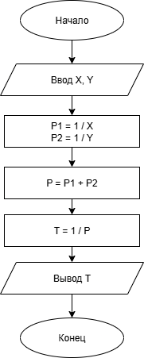

# Домашнее задание к работе 2

## Условие задачи
О двух бригадах строителей известно, что первая бригада может построить дом за Х
дней, а вторая за Y дней при одинаковом качестве. Определить сколько дней
потребуется для строительства этого дома двум бригадам вместе

## 1. Алгоритм и блок-схема

### Алгоритм
1. **Начало**
2. Задать исходные данные:
   - `x` = 15 — количество дней, за которое дом строит первая бригада.
   - `y` = 20 — количество дней, за которое дом строит вторая бригада.
3. Определить производительность каждой бригады:
   - `P1 = 1 / X` — доля дома, которую строит первая бригада за 1 день.
   - `P2 = 1 / Y` — доля дома, которую строит вторая бригада за 1 день.
4. Найти совместную производительность:
   - `P = P1 + P2`
5. Вычислить время строительства дома двумя бригадами:
   - `T = 1 / P`
8. Вывести результаты расчетов с подстановкой всех значений в текст.
9. **Конец**

### Блок-схема

 

## 2. Реализация программы

```
#include <stdio.h>
#include <locale.h>

int main()
{
	setlocale(LC_CTYPE, "RUS");

	int X = 15;
	int Y = 20;

	double P1 = 1.0 / X;
	double P2 = 1.0 / Y;

	double P = P1 + P2;

	double T = 1.0 / P;

	printf("Первая бригада может построить дом за %d дней.\n", X);
	printf("Вторая бригада может построить дом за %d дней.\n", Y);
	printf("Обе бригады вместе построят дом за %.2f дней.\n", T);

	return 0;
}
```

## 3. Результаты работы программы

Первая бригада может построить дом за 15 дней.
Вторая бригада может построить дом за 20 дней.
Обе бригады вместе построят дом за 8.57 дней.

## 4. Информация о разработчике

Шалаев Максим [БИЦ-252]
